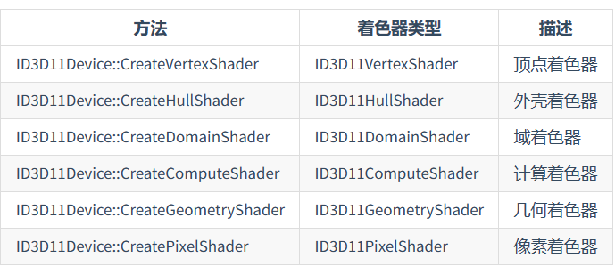

# Windows初始化

* 注册Class

  ```c++
  WNDCLASSEX wc = { 0 };
  wc.cbSize = sizeof(wc);
  wc.style = CS_OWNDC;
  wc.lpfnWndProc = WndProc;
  wc.cbClsExtra = 0;
  wc.cbWndExtra = 0;
  wc.hInstance = hInstance;
  wc.hIcon = nullptr;
  wc.hCursor = nullptr;
  wc.hbrBackground = nullptr;
  wc.lpszMenuName = nullptr;
  wc.lpszClassName = pClassName;
  wc.hIconSm = nullptr;
  
  RegisterClassEx(&wc);
  ```

* 创建Instance

  ```c++
  HWND hwnd = CreateWindowEx(
  	0, pClassName, "Interesting",
  	WS_CAPTION | WS_MINIMIZEBOX | WS_SYSMENU,
  	200, 200, 640, 480,
  	nullptr, nullptr, hInstance, nullptr
  );
  ```

* ShowWindow

  ```c++
  ShowWindow(hwnd, SW_SHOW);
  ```

消息处理函数（处理Windows和接收Windows消息）

```c++
LRESULT CALLBACK WndProc(HWND hwnd, UINT msg, WPARAM wParam, LPARAM lParam)
```

其中，hwnd表示窗口句柄，msg表示消息，而`wParam`和`lParam`则根据msg表示不同的含义

msg的`WM_KEYDOWN` 和 `WM_KEYUP`表示按键按下和松开，对于按下为字符，则为`WM_CHAR`。如果按下了字符，消息`WM_CHAR` 和 `WM_KEYDOWN`会同时触发。

函数`TranslateMessage(&msg);`会在一定条件下将`WM_KEYDOWN`转换为`KEY_CHAR`


winAPI中有一个计数器，当≤0时隐藏光标，＞0时显示光标

ShowCursor(FALSE)会减少这个计数器，ShowCursor(TRUE)会增加这个计数器


Direct架构

D3D使用的是COM接口，Device是所有资源的基类，所有资源都是从Device创建的

Device就是图形适配器，或者说逻辑显卡，可以被具有硬件驱动程序的实际物理接口支持


DXGI承担的是底层的可从D3D剥夺出去的任务，DXGI现在的工作是遍历设备上所有可用的硬件，显示渲染帧，控制Gamma值等

设备基本上用于分配资源，创建各种不同的对象；而上下文用于发出渲染命令并配置渲染管线。

上下文分为**即时**和**延迟**两种


调用即时上下文时，会让硬件立马执行渲染工作；而延时上下文会建立指令集，然后将指令发布到即时上下文

延时上下文做不到**查询图形驱动程序** 


# D3D初始化

Direct3D初始化阶段首先需要创建**D3D设备**和**D3D设备上下文**

**D3D设备**（`ID3D11Device`）通常代表一个显示适配器（即显卡），它最主要的功能是用于创建各种所需资源，最常用的资源有：**资源类（ID3D11Resource, 包含纹理和缓冲区）**，**视图类**以及**着色器**。此外，D3D设备还能够用于检测系统环境对功能的支持情况。

**D3D设备上下文**(`ID3D11DeviceContext`)可以看做是一个渲染管线。通常我们在创建D3D设备的同时也会附赠一个**立即设备上下文**(Immediate Context)。一个D3D设备仅对应一个D3D立即设备上下文，并且只要我们拥有其中一方，就能通过各自的方法获取另一方（即`ID3D11Device::GetImmediateContext`和`ID3D11DeviceContext::GetDevice`）。渲染管线主要负责渲染和计算工作，它需要绑定来自与它关联的D3D设备所创建的各种资源、视图和着色器才能正常运转，除此之外，它还能够负责对资源的直接读写操作。

如果你的系统支持Direct3D 11.1的话，则对应的接口类为：`ID3D11Device1`、`ID3D11DeviceContext1`，它们分别继承自上面的两个接口类，区别在于额外提供了少数新的接口，并且接口方法的实现可能会有所区别。


创建D3D设备、D3D设备上下文：

```c++
HRESULT WINAPI D3D11CreateDevice(
    IDXGIAdapter* pAdapter,             // [In_Opt]适配器
    D3D_DRIVER_TYPE DriverType,         // [In]驱动类型
    HMODULE Software,                   // [In_Opt]若上面为D3D_DRIVER_TYPE_SOFTWARE则这里需要提供程序模块
    UINT Flags,                         // [In]使用D3D11_CREATE_DEVICE_FLAG枚举类型
    D3D_FEATURE_LEVEL* pFeatureLevels,  // [In_Opt]若为nullptr则为默认特性等级，否则需要提供特性等级数组
    UINT FeatureLevels,                 // [In]特性等级数组的元素数目
    UINT SDKVersion,                    // [In]SDK版本，默认D3D11_SDK_VERSION
    ID3D11Device** ppDevice,            // [Out_Opt]输出D3D设备
    D3D_FEATURE_LEVEL* pFeatureLevel,   // [Out_Opt]输出当前应用D3D特性等级
    ID3D11DeviceContext** ppImmediateContext ); //[Out_Opt]输出D3D设备上下文
```

1. 关于`pAdapter`(显示适配器)，我们可以将它看做是对显示卡设备的一层封装，通过该参数，我们可以指定需要使用哪个显示卡设备。通常该参数我们设为`nullptr`，这样就可以交由上层驱动来帮我们决定使用哪个显卡，或者在**NVIDIA控制面板**来设置当前程序要使用哪个显卡。如果想要在应用层决定，使用`IDXGIFactory::EnumAdapters`方法可以枚举当前可用的显示卡设备。
2. `DriverType`则指定了驱动类型，不过通常大多数情况都会支持`D3D_DRIVER_TYPE_HARDWARE`，以享受硬件加速带来的效益。


### 总体流程

```c++
    HRESULT hr = S_OK;

    // 创建D3D设备 和 D3D设备上下文
    UINT createDeviceFlags = 0;
#if defined(DEBUG) || defined(_DEBUG)  
    createDeviceFlags |= D3D11_CREATE_DEVICE_DEBUG;
#endif
    // 驱动类型数组
    D3D_DRIVER_TYPE driverTypes[] =
    {
        D3D_DRIVER_TYPE_HARDWARE,
        D3D_DRIVER_TYPE_WARP,
        D3D_DRIVER_TYPE_REFERENCE,
    };
    UINT numDriverTypes = ARRAYSIZE(driverTypes);

    // 特性等级数组
    D3D_FEATURE_LEVEL featureLevels[] =
    {
        D3D_FEATURE_LEVEL_11_1,
        D3D_FEATURE_LEVEL_11_0,
    };
    UINT numFeatureLevels = ARRAYSIZE(featureLevels);

    D3D_FEATURE_LEVEL featureLevel;
    D3D_DRIVER_TYPE d3dDriverType;
    for (UINT driverTypeIndex = 0; driverTypeIndex < numDriverTypes; driverTypeIndex++)
    {
        d3dDriverType = driverTypes[driverTypeIndex];
        hr = D3D11CreateDevice(nullptr, d3dDriverType, nullptr, createDeviceFlags, featureLevels, numFeatureLevels,
            D3D11_SDK_VERSION, m_pd3dDevice.GetAddressOf(), &featureLevel, m_pd3dImmediateContext.GetAddressOf());

        if (hr == E_INVALIDARG)
        {
            // Direct3D 11.0 的API不承认D3D_FEATURE_LEVEL_11_1，所以我们需要尝试特性等级11.0以及以下的版本
            hr = D3D11CreateDevice(nullptr, d3dDriverType, nullptr, createDeviceFlags, &featureLevels[1], numFeatureLevels - 1,
                D3D11_SDK_VERSION, m_pd3dDevice.GetAddressOf(), &featureLevel, m_pd3dImmediateContext.GetAddressOf());
        }

        if (SUCCEEDED(hr))
            break;
    }

    if (FAILED(hr))
    {
        MessageBox(0, L"D3D11CreateDevice Failed.", 0, 0);
        return false;
    }

    // 检测是否支持特性等级11.0或11.1
    if (featureLevel != D3D_FEATURE_LEVEL_11_0 && featureLevel != D3D_FEATURE_LEVEL_11_1)
    {
        MessageBox(0, L"Direct3D Feature Level 11 unsupported.", 0, 0);
        return false;
    }

    // 检测 MSAA支持的质量等级
    m_pd3dDevice->CheckMultisampleQualityLevels(
        DXGI_FORMAT_R8G8B8A8_UNORM, 4, &m_4xMsaaQuality);
    assert(m_4xMsaaQuality > 0);

    ComPtr<IDXGIDevice> dxgiDevice = nullptr;
    ComPtr<IDXGIAdapter> dxgiAdapter = nullptr;
    ComPtr<IDXGIFactory1> dxgiFactory1 = nullptr;	// D3D11.0(包含DXGI1.1)的接口类
    ComPtr<IDXGIFactory2> dxgiFactory2 = nullptr;	// D3D11.1(包含DXGI1.2)特有的接口类

    // 为了正确创建 DXGI交换链，首先我们需要获取创建 D3D设备 的 DXGI工厂，否则会引发报错：
    // "IDXGIFactory::CreateSwapChain: This function is being called with a device from a different IDXGIFactory."
    HR(m_pd3dDevice.As(&dxgiDevice));
    HR(dxgiDevice->GetAdapter(dxgiAdapter.GetAddressOf()));
    HR(dxgiAdapter->GetParent(__uuidof(IDXGIFactory1), reinterpret_cast<void**>(dxgiFactory1.GetAddressOf())));

    // 查看该对象是否包含IDXGIFactory2接口
    hr = dxgiFactory1.As(&dxgiFactory2);
    // 如果包含，则说明支持D3D11.1
    if (dxgiFactory2 != nullptr)
    {
        HR(m_pd3dDevice.As(&m_pd3dDevice1));
        HR(m_pd3dImmediateContext.As(&m_pd3dImmediateContext1));
        // 填充各种结构体用以描述交换链
        DXGI_SWAP_CHAIN_DESC1 sd;
        ZeroMemory(&sd, sizeof(sd));
        sd.Width = m_ClientWidth;
        sd.Height = m_ClientHeight;
        sd.Format = DXGI_FORMAT_R8G8B8A8_UNORM;
        // 是否开启4倍多重采样？
        if (m_Enable4xMsaa)
        {
            sd.SampleDesc.Count = 4;
            sd.SampleDesc.Quality = m_4xMsaaQuality - 1;
        }
        else
        {
            sd.SampleDesc.Count = 1;
            sd.SampleDesc.Quality = 0;
        }
        sd.BufferUsage = DXGI_USAGE_RENDER_TARGET_OUTPUT;
        sd.BufferCount = 1;
        sd.SwapEffect = DXGI_SWAP_EFFECT_DISCARD;
        sd.Flags = 0;

        DXGI_SWAP_CHAIN_FULLSCREEN_DESC fd;
        fd.RefreshRate.Numerator = 60;
        fd.RefreshRate.Denominator = 1;
        fd.Scaling = DXGI_MODE_SCALING_UNSPECIFIED;
        fd.ScanlineOrdering = DXGI_MODE_SCANLINE_ORDER_UNSPECIFIED;
        fd.Windowed = TRUE;
        // 为当前窗口创建交换链
        HR(dxgiFactory2->CreateSwapChainForHwnd(m_pd3dDevice.Get(), m_hMainWnd, &sd, &fd, nullptr, m_pSwapChain1.GetAddressOf()));
        HR(m_pSwapChain1.As(&m_pSwapChain));
    }
else	// 交换链IDXGISwapChain的创建
{
    // 填充DXGI_SWAP_CHAIN_DESC用以描述交换链
    DXGI_SWAP_CHAIN_DESC sd;
    ZeroMemory(&sd, sizeof(sd));
    sd.BufferDesc.Width = m_ClientWidth;
    sd.BufferDesc.Height = m_ClientHeight;
    sd.BufferDesc.RefreshRate.Numerator = 60;
    sd.BufferDesc.RefreshRate.Denominator = 1;
    sd.BufferDesc.Format = DXGI_FORMAT_R8G8B8A8_UNORM;
    sd.BufferDesc.ScanlineOrdering = DXGI_MODE_SCANLINE_ORDER_UNSPECIFIED;
    sd.BufferDesc.Scaling = DXGI_MODE_SCALING_UNSPECIFIED;
    // 是否开启4倍多重采样？
    if (m_Enable4xMsaa)
    {
        sd.SampleDesc.Count = 4;
        sd.SampleDesc.Quality = m_4xMsaaQuality - 1;
    }
    else
    {
        sd.SampleDesc.Count = 1;
        sd.SampleDesc.Quality = 0;
    }
    sd.BufferUsage = DXGI_USAGE_RENDER_TARGET_OUTPUT;
    sd.BufferCount = 1;
    sd.OutputWindow = m_hMainWnd;
    sd.Windowed = TRUE;
    sd.SwapEffect = DXGI_SWAP_EFFECT_DISCARD;
    sd.Flags = 0;
    HR(dxgiFactory1->CreateSwapChain(m_pd3dDevice.Get(), &sd, m_pSwapChain.GetAddressOf()));
}
```


### DXGI交换链

**DXGI交换链**(`IDXGISwapChain`)缓存了一个或多个表面(2D纹理)，它们都可以称作后备缓冲区(backbuffer)。后备缓冲区则是我们主要进行渲染的场所，我们可以将这些缓冲区通过合适的手段成为渲染管线的输出对象。在进行呈现(Present)的时候有两种方法：

1. **BitBlt Model（位块传输模型）**：将后备缓冲区的数据进行BitBlt(**位块传输，即内容上的拷贝**)，传入到DWM与DX共享的后备缓冲区，然后进行翻转以显示其内容。使用这种模型至少需要一个后备缓冲区。事实上，这也是Win32应用程序最常使用的方式，在进行呈现后，渲染管线仍然是对同一个后备缓冲区进行输出。（支持Windows 7及更高版本）

2. **Flip Model（翻转模型）**：该模型可以避免上一种方式多余的复制，后备缓冲区表面可以直接与DWM内的前台缓冲区进行翻转。但是需要创建至少两个后备缓冲区，并且在每次完成呈现后通过代码切换到另一个后备缓冲区进行渲染。该模型可以用于Win32应用程序以及UWP应用程序（需要DXGI1.2，支持Windows 8及更高版本）

   


DXGI交换链的创建需要通过`IDXGIFactory::CreateSwapChain`方法进行。但是，如果是要创建Direct3D 11.1对应的交换链，则需要通过`IDXGIFactory2::CreateSwapChainForHwnd`方法进行。


之前在创建D3D设备时使用的是默认的显卡适配器`IDXGIAdapter`（对于双显卡的笔记本大概率使用的是集成显卡），而创建出来的D3D设备本身实现了`IDXGIDevice`接口，通过该对象，我们可以获取到当前所用的显卡适配器`IDXGIAdapter`对象，这样我们再通过查询它的父级找到是哪个`IDXGIFactory`枚举出来的适配器

```c++
ComPtr<IDXGIDevice> dxgiDevice = nullptr;
ComPtr<IDXGIAdapter> dxgiAdapter = nullptr;
ComPtr<IDXGIFactory1> dxgiFactory1 = nullptr;    // D3D11.0(包含DXGI1.1)的接口类
ComPtr<IDXGIFactory2> dxgiFactory2 = nullptr;    // D3D11.1(包含DXGI1.2)特有的接口类

// 为了正确创建 DXGI交换链，首先我们需要获取创建 D3D设备 的 DXGI工厂，否则会引发报错：
// "IDXGIFactory::CreateSwapChain: This function is being called with a device from a different IDXGIFactory."
HR(m_pd3dDevice.As(&dxgiDevice));
HR(dxgiDevice->GetAdapter(dxgiAdapter.GetAddressOf()));
HR(dxgiAdapter->GetParent(__uuidof(IDXGIFactory1), reinterpret_cast<void**>(dxgiFactory1.GetAddressOf())));
```


针对DirectX3D 11.1，需要填充`DXGI_SWAP_CHAIN_DESC1`和`DXGI_SWAP_CHAIN_FULLSCREEN_DESC`这两个结构体：

```c++
typedef struct DXGI_SWAP_CHAIN_DESC1
{
    UINT Width;                     // 分辨率宽度
    UINT Height;                    // 分辨率高度
    DXGI_FORMAT Format;             // 缓冲区数据格式
    BOOL Stereo;                    // 忽略    
    DXGI_SAMPLE_DESC SampleDesc;    // 采样描述
    DXGI_USAGE BufferUsage;         // 缓冲区用途
    UINT BufferCount;               // 缓冲区数目
    DXGI_SCALING Scaling;           // 忽略
    DXGI_SWAP_EFFECT SwapEffect;    // 交换效果
    DXGI_ALPHA_MODE AlphaMode;      // 忽略
    UINT Flags;                     // 使用DXGI_SWAP_CHAIN_FLAG枚举类型
} DXGI_SWAP_CHAIN_DESC1;

typedef struct DXGI_SAMPLE_DESC
{
    UINT Count;                     // MSAA采样数
    UINT Quality;                   // MSAA质量等级
} DXGI_SAMPLE_DESC;

typedef struct DXGI_SWAP_CHAIN_FULLSCREEN_DESC
{
    DXGI_RATIONAL RefreshRate;                    // 刷新率
    DXGI_MODE_SCANLINE_ORDER ScanlineOrdering;    // 忽略
    DXGI_MODE_SCALING Scaling;                    // 忽略
    BOOL Windowed;                                // 是否窗口化
} DXGI_SWAP_CHAIN_FULLSCREEN_DESC;

typedef struct DXGI_RATIONAL
{
    UINT Numerator;                 // 刷新率分子
    UINT Denominator;               // 刷新率分母
} DXGI_RATIONAL;
```

填充完上述结构体后，创建交换链方法：

```c++
HRESULT IDXGIFactory2::CreateSwapChainForHwnd(
    IUnknown *pDevice,                         // [In]D3D设备
    HWND hWnd,                                 // [In]窗口句柄
    const DXGI_SWAP_CHAIN_DESC1 *pDesc,        // [In]交换链描述1
    const DXGI_SWAP_CHAIN_FULLSCREEN_DESC *pFullscreenDesc,    // [In]交换链全屏描述，可选
    IDXGIOutput *pRestrictToOutput,            // [In]忽略
    IDXGISwapChain1 **ppSwapChain);            // [Out]输出交换链对象
```


交换链创建整体流程

```c++
DXGI_SWAP_CHAIN_DESC1 sd;
ZeroMemory(&sd, sizeof(sd));
sd.Width = m_ClientWidth;
sd.Height = m_ClientHeight;
sd.Format = DXGI_FORMAT_R8G8B8A8_UNORM;
// 是否开启4倍多重采样？
if (m_Enable4xMsaa)
{
    sd.SampleDesc.Count = 4;
    sd.SampleDesc.Quality = m_4xMsaaQuality - 1;
}
else
{
    sd.SampleDesc.Count = 1;
    sd.SampleDesc.Quality = 0;
}
sd.BufferUsage = DXGI_USAGE_RENDER_TARGET_OUTPUT;
sd.BufferCount = 1;
sd.SwapEffect = DXGI_SWAP_EFFECT_DISCARD;
sd.Flags = 0;

DXGI_SWAP_CHAIN_FULLSCREEN_DESC fd;
fd.RefreshRate.Numerator = 60;
fd.RefreshRate.Denominator = 1;
fd.Scaling = DXGI_MODE_SCALING_UNSPECIFIED;
fd.ScanlineOrdering = DXGI_MODE_SCANLINE_ORDER_UNSPECIFIED;
fd.Windowed = TRUE;
// 为当前窗口创建交换链
HR(dxgiFactory2->CreateSwapChainForHwnd(m_pd3dDevice.Get(), m_hMainWnd, &sd, &fd, nullptr, m_pSwapChain1.GetAddressOf()));
HR(m_pSwapChain1.As(&m_pSwapChain));
```


向用户呈现图像

```c++
HRESULT Present(
  UINT SyncInterval,	//指定如何将框架的呈现与垂直空白同步。
  UINT Flags
);
```

针对SynInterval，指定如何将框架的呈现与垂直空白同步。

对于位块传输 (bitblt) 模型 ([DXGI_SWAP_EFFECT_DISCARD](https://learn.microsoft.com/zh-cn/windows/win32/api/dxgi/ne-dxgi-dxgi_swap_effect) 或 [DXGI_SWAP_EFFECT_SEQUENTIAL](https://learn.microsoft.com/zh-cn/windows/win32/api/dxgi/ne-dxgi-dxgi_swap_effect)) ，值为：

- 0 - 演示文稿立即发生，没有同步。
- 1 到 4 - 同步 *n*个垂直空白之后的演示文稿。

对于翻转模型 ([DXGI_SWAP_EFFECT_FLIP_SEQUENTIAL](https://learn.microsoft.com/zh-cn/windows/win32/api/dxgi/ne-dxgi-dxgi_swap_effect)) ，值为：

- 0 - 取消之前显示的帧上的剩余时间，如果较新的帧排队，则放弃此帧。
- 1 到 4 - 同步至少 *n 个* 垂直空白的演示文稿。

有关显示同步间隔值如何影响翻转演示文稿队列的示例，请参阅备注。

如果更新区域跨多个输出 (每个输出由 [IDXGIOutput](https://learn.microsoft.com/zh-cn/windows/win32/api/dxgi/nn-dxgi-idxgioutput)) 表示， **则 Present** 将执行与包含目标窗口工作区最大子矩形的输出的同步。


在创建好上述对象后，如果窗口的大小是固定的，则需要经历下面的步骤：

1. 获取交换链后备缓冲区的`ID3D11Texture2D`接口对象
2. 为后备缓冲区创建渲染目标视图`ID3D11RenderTargetView`
3. 通过D3D设备创建一个`ID3D11Texture2D`用作深度/模板缓冲区，要求与后备缓冲区等宽高
4. 创建深度/模板视图`ID3D11DepthStrenilView`，绑定刚才创建的2D纹理
5. 通过D3D设备上下文，在渲染管线的输出合并阶段设置渲染目标
6. 在渲染管线的光栅化阶段设置好渲染的视口区域


#### 获取交换链的后备缓冲区

创建好的交换链已经包含1个后备缓冲区了

```c++
HRESULT IDXGISwapChain::GetBuffer( 
    UINT Buffer,        // [In]缓冲区索引号，从0到BufferCount - 1
    REFIID riid,        // [In]缓冲区的接口类型ID
    void **ppSurface);  // [Out]获取到的缓冲区
```

#### 为后备缓冲区创建渲染目标视图

**渲染目标视图**用于将渲染管线的运行结果输出给其绑定的资源，很明显它也只能够设置给输出合并阶段。渲染目标视图要求其绑定的资源是允许GPU读写的，因为在作为管线输出时会通过GPU写入数据，并且在以后进行混合操作时还需要在GPU读取该资源。通常渲染目标是一个二维的纹理，但它依旧可能会绑定其余类型的资源。

```c++
HRESULT ID3D11Device::CreateRenderTargetView( 
    ID3D11Resource *pResource,                      // [In]待绑定到渲染目标视图的资源
    const D3D11_RENDER_TARGET_VIEW_DESC *pDesc,     // [In]忽略
    ID3D11RenderTargetView **ppRTView);             // [Out]获取渲染目标视图
```

#### 创建2D纹理

```c++
typedef struct D3D11_TEXTURE2D_DESC
{
    UINT Width;         // 缓冲区宽度
    UINT Height;        // 缓冲区高度
    UINT MipLevels;     // Mip等级
    UINT ArraySize;     // 纹理数组中的纹理数量，默认1
    DXGI_FORMAT Format; // 缓冲区数据格式
    DXGI_SAMPLE_DESC SampleDesc;    // MSAA采样描述
    D3D11_USAGE Usage;  // 数据的CPU/GPU访问权限
    UINT BindFlags;     // 使用D3D11_BIND_FLAG枚举来决定该数据的使用类型
    UINT CPUAccessFlags;    // 使用D3D11_CPU_ACCESS_FLAG枚举来决定CPU访问权限
    UINT MiscFlags;     // 使用D3D11_RESOURCE_MISC_FLAG枚举，这里默认0
}     D3D11_TEXTURE2D_DESC;
```

1. 如果你希望它不产生mipmap，则应当指定为1(只包含最大的位图本身)
2. 如果你希望它能够产生完整的mipmap，可以指定为0，这样你就不需要手工去算这个纹理最大支持的mipmap等级数了，在创建好纹理后，可以再调用`ID3D11Texture2D::GetDesc`来查看实际的`MipLevels`值是多少
3. 如果你指定的是其它的值，这里举个例子，该纹理的宽高为`400x400`，mip等级为3时，该纹理会产生`400x400`，`200x200`和`100x100`的mipmap

**`Usage`：**

| D3D11_USAGE           | CPU读 | CPU写 | GPU读 | GPU写 |
| --------------------- | ----- | ----- | ----- | ----- |
| D3D11_USAGE_DEFAULT   |       |       | √     | √     |
| D3D11_USAGE_IMMUTABLE |       |       | √     |       |
| D3D11_USAGE_DYNAMIC   |       | √     | √     |       |
| D3D11_USAGE_STAGING   | √     | √     | √     | √     |

如果一个纹理以`D3D11_USAGE_DEFAULT`的方式创建，那么它可以使用下面的这些方法来更新纹理：

1. `ID3D11DeviceContext::UpdateSubresource`（CPU->GPU临时空间->目标GPU资源）
2. `ID3D11DeviceContext::CopyResource`
3. `ID3D11DeviceContext::CopySubresourceRegion`

通过`DDSTextureLoader`或`WICTextureLoader`创建出来的纹理默认都是这种类型

而如果一个纹理以`D3D11_USAGE_IMMUTABLE`的方式创建，则必须在创建阶段就完成纹理资源的初始化。此后GPU只能读取，也无法对纹理再进行修改

`D3D11_USAGE_DYNAMIC`创建的纹理通常需要频繁从CPU写入，使用`ID3D11DeviceContext::Map`方法创建一片内存来映射对应的显存，经过修改后再调用`ID3D11DeviceContext::Unmap`方法应用更改。动态纹理不能是数组，且mip等级只能是1，即不能有mipmaps。

而`D3D11_USAGE_STAGING`则完全允许在CPU和GPU之间的数据传输，但它只能作为一个类似中转站的资源，而不能绑定到渲染管线上，即你也不能用该纹理生成mipmaps。比如说有一个`D3D11_USAGE_DEFAULT`你想要从显存拿到内存，只能通过它以`ID3D11DeviceContext::CopyResource`或者`ID3D11DeviceContext::CopySubresourceRegion`方法来复制一份到本纹理，然后再通过`ID3D11DeviceContext::Map`方法取出到内存。

```c++
HRESULT ID3D11Device::CreateTexture2D( 
    const D3D11_TEXTURE2D_DESC *pDesc,          // [In] 2D纹理描述信息
    const D3D11_SUBRESOURCE_DATA *pInitialData, // [In] 用于初始化的资源
    ID3D11Texture2D **ppTexture2D);             // [Out] 获取到的2D纹理
```

#### 创建深度/模板视图

```c++
HRESULT ID3D11Device::CreateDepthStencilView( 
    ID3D11Resource *pResource,                      // [In] 需要绑定的资源
    const D3D11_DEPTH_STENCIL_VIEW_DESC *pDesc,     // [In] 深度缓冲区描述，这里忽略
    ID3D11DepthStencilView **ppDepthStencilView);   // [Out] 获取到的深度/模板视图
```

#### 为渲染管线的输出合并阶段设置渲染目标

```c++
void ID3D11DeviceContext::OMSetRenderTargets( 
    UINT NumViews,                                      // [In] 视图数目
    ID3D11RenderTargetView *const *ppRenderTargetViews, // [In] 渲染目标视图数组
    ID3D11DepthStencilView *pDepthStencilView) = 0;     // [In] 深度/模板视图
```

#### 视口设置

将整个视图输出到窗口特定的范围

```c++
typedef struct D3D11_VIEWPORT
{
    FLOAT TopLeftX;     // 屏幕左上角起始位置X
    FLOAT TopLeftY;     // 屏幕左上角起始位置Y
    FLOAT Width;        // 宽度
    FLOAT Height;       // 高度
    FLOAT MinDepth;     // 最小深度，必须为0.0f
    FLOAT MaxDepth;     // 最大深度，必须为1.0f
}     D3D11_VIEWPORT;
```

```c++
void ID3D11DeviceContext::RSSetViewports(
    UINT  NumViewports,                     // 视口数目
    const D3D11_VIEWPORT *pViewports);      // 视口数组
```

#### 调整后备缓冲区的分辨率

已知深度模板缓冲区和视口都可以直接重新创建一份来进行替换。至于后备缓冲区，我们可以通过`IDXGISwapChain::ResizeBuffers`来重新调整后备缓冲区的分辨率：

```c++
HRESULT IDXGISwapChain::ResizeBuffers(
  UINT        BufferCount,            // [In]缓冲区数目
  UINT        Width,                // [In]新分辨率宽度
  UINT        Height,                // [In]新分辨率高度
  DXGI_FORMAT NewFormat,            // [In]DXGI格式
  UINT        SwapChainFlags        // [In]忽略
);
```


## 异常

加载DLL函数：

```c++
HMODULE LoadLibraryA(
  [in] LPCSTR lpLibFileName
);
```

从DLL中检索函数/变量的地址

```c++
 FARPROC GetProcAddress(
  [in] HMODULE hModule,
  [in] LPCSTR  lpProcName
);
```


## 着色器

### 创建着色器



```c++
HRESULT ID3D11Device::CreateVertexShader( 
    const void *pShaderBytecode,            // [In]着色器字节码
    SIZE_T BytecodeLength,                  // [In]字节码长度
    ID3D11ClassLinkage *pClassLinkage,      // [In_Opt]忽略
    ID3D11VertexShader **ppVertexShader);   // [Out]获取顶点着色器
```


由于顶点缓冲区的本质是二进制流，为了能够建立C++结构体与HLSL结构体的对应关系，需要使用`ID3D11InputLayout`输入布局来描述每一个成员的用途、语义、大小等信息。

```c++
typedef struct D3D11_INPUT_ELEMENT_DESC
{
    LPCSTR SemanticName;        // 语义名
    UINT SemanticIndex;         // 语义索引
    DXGI_FORMAT Format;         // 数据格式
    UINT InputSlot;             // 输入槽索引(0-15)
    UINT AlignedByteOffset;     // 初始位置(字节偏移量)      
    D3D11_INPUT_CLASSIFICATION InputSlotClass; // 输入类型
    UINT InstanceDataStepRate;  // 忽略
}     D3D11_INPUT_ELEMENT_DESC;
```

### **创建输入布局**

```c++
HRESULT ID3D11Device::CreateInputLayout( 
    const D3D11_INPUT_ELEMENT_DESC *pInputElementDescs, // [In]输入布局描述
    UINT NumElements,                                   // [In]上述数组元素个数
    const void *pShaderBytecodeWithInputSignature,      // [In]顶点着色器字节码
    SIZE_T BytecodeLength,                              // [In]顶点着色器字节码长度
    ID3D11InputLayout **ppInputLayout);                 // [Out]获取的输入布局
```

### **使用输入布局**

```c++
void ID3D11DeviceContext::IASetInputLayout( 
    ID3D11InputLayout *pInputLayout);   // [In]输入布局
```


## 顶点缓冲区

### 创建顶点缓冲区

先填充顶点缓冲区描述符`D3D11_BUFFER_DESC`，其中属性`D3D11_USAGE Usage` 对应的读写关系为：


对于`D3D11_USAGE_DEFAULT`类型的缓冲区，应当使用 `ID3D11DeviceContext::UpdateSubresource`方法来更新缓冲区资源，它的原理是将内存中的某段数据传递到显存中，然后再将该显存中的数据复制到在显存中的缓冲区。这种更新方式我们是无法直接访问缓冲区的内容的。在绘制完成/开始前调用可以比较快地更新显存中的数据。

而对于`D3D11_USAGE_DYNAMIC`类型的缓冲区，则应当使用`ID3D11DeviceContext::Map`和D3D11_TEXTURE2D_DESC`ID3D11DeviceContext::Unmap`方法，将显存中的数据映射到内存中，然后修改该片内存的数据，最后将修改好的数据映射回显存中。这种更新方式我们是可以直接获取来自显存的数据的，但代价就是更新的效率会比上面的方式更低一些。


```c++
bool GameApp::InitResource()
{
    // 设置三角形顶点
    VertexPosColor vertices[] =
    {
        { XMFLOAT3(0.0f, 0.5f, 0.5f), XMFLOAT4(0.0f, 1.0f, 0.0f, 1.0f) },
        { XMFLOAT3(0.5f, -0.5f, 0.5f), XMFLOAT4(0.0f, 0.0f, 1.0f, 1.0f) },
        { XMFLOAT3(-0.5f, -0.5f, 0.5f), XMFLOAT4(1.0f, 0.0f, 0.0f, 1.0f) }
    };
    // 设置顶点缓冲区描述
    D3D11_BUFFER_DESC vbd;
    ZeroMemory(&vbd, sizeof(vbd));
    vbd.Usage = D3D11_USAGE_IMMUTABLE;	//CPU和GPU的读写权限相关
    vbd.ByteWidth = sizeof vertices; //数据字节数
    vbd.BindFlags = D3D11_BIND_VERTEX_BUFFER; //缓冲区类型的标志
    vbd.CPUAccessFlags = 0;	//CPU读写权限的指定
    
    // 新建顶点缓冲区
    D3D11_SUBRESOURCE_DATA InitData;
    ZeroMemory(&InitData, sizeof(InitData));
    InitData.pSysMem = vertices;	//用于初始化的数据
    //创建顶点缓冲区
    HR(m_pd3dDevice->CreateBuffer(&vbd, &InitData, m_pVertexBuffer.GetAddressOf())); 
   
   
    // ******************
    // 给渲染管线各个阶段绑定好所需资源
   
    // 输入装配阶段的顶点缓冲区设置
    UINT stride = sizeof(VertexPosColor);    // 对所有缓冲区每次读取的字节数分别是多少
    UINT offset = 0;                        // 起始偏移量
   
    // 0为输入槽索引，1为缓冲区数目
    m_pd3dImmediateContext->IASetVertexBuffers(0, 1, m_pVertexBuffer.GetAddressOf(), &stride, &offset);
    // 设置图元类型，设定输入布局
    m_pd3dImmediateContext->IASetPrimitiveTopology(D3D11_PRIMITIVE_TOPOLOGY_TRIANGLELIST);
    m_pd3dImmediateContext->IASetInputLayout(m_pVertexLayout.Get());
    // 将着色器绑定到渲染管线
    m_pd3dImmediateContext->VSSetShader(m_pVertexShader.Get(), nullptr, 0);
    m_pd3dImmediateContext->PSSetShader(m_pPixelShader.Get(), nullptr, 0);

    return true;
}
```


设置完之后就可以根据已经绑定的顶点缓冲区进行绘制

```c++
void ID3D11DeviceContext::Draw( 
    UINT VertexCount,           // [In]需要绘制的顶点数目
    UINT StartVertexLocation);  // [In]起始顶点索引
```


## 索引缓冲区

索引缓冲区对应的缓冲区描述符与顶点缓冲区的基本没有差别，除了绑定的标志不一样

```c++
ibd.BindFlags = D3D11_BIND_INDEX_BUFFER;
```

### 设置索引缓冲区

在装配的时候你需要指定每个索引所占的字节数：


```c++
void ID3D11DeviceContext::IASetIndexBuffer( 
    ID3D11Buffer *pIndexBuffer,     // [In]索引缓冲区
    DXGI_FORMAT Format,             // [In]数据格式
    UINT Offset);                   // [In]字节偏移量
```


## 常量缓冲区

目前**常量缓冲区**有两种运行时更新方式：

1. 在创建资源的时候指定`Usage`为`D3D11_USAGE_DEFAULT`，可以允许常量缓冲区从GPU写入，需要用`ID3D11DeviceContext::UpdateSubresource`方法更新。
2. 在创建资源的时候指定`Usage`为`D3D11_USAGE_DYNAMIC`、`CPUAccessFlags`为`D3D11_CPU_ACCESS_WRITE`，允许常量缓冲区从CPU写入，首先通过`ID3D11DeviceContext::Map`方法获取内存映射，然后再更新到映射好的内存区域，最后通过`ID3D11DeviceContext::Unmap`方法解除占用。

> 在创建常量缓冲区时，描述参数`ByteWidth`必须为16的倍数，因为HLSL的常量缓冲区本身以及对它的读写操作需要严格按16字节对齐


在输入装配阶段指定好了顶点缓冲区、索引缓冲区和原始拓补类型后，再绑定常量缓冲区到顶点着色阶段，最后就可以使用`ID3D11DeviceContext::DrawIndexed`方法来绘制：

```c++
void ID3D11DeviceContext::DrawIndexed( 
    UINT IndexCount,            // 索引数目
    UINT StartIndexLocation,    // 起始索引位置
    INT BaseVertexLocation);    // 起始顶点位置
```


**向量之间的运算，对于自定义函数，只要是使用了`XMVECTOR`或者`XMMATRIX`作为形参，则必须在函数名前加上`XM_CALLCONV`，否则在x86模式可能会出现下述错误：** `formal parameter with requested alignment of 16 won't be aligned`


获取常量缓冲区

```c++
void ID3D11DeviceContext::VSGetConstantBuffers( 
    UINT StartSlot,     // [In]指定的起始槽索引
    UINT NumBuffers,    // [In]常量缓冲区数目 
    ID3D11Buffer **ppConstantBuffers) = 0;    // [Out]常量固定缓冲区数组
```


## 光栅化状态

光栅化描述符

```c++
typedef struct D3D11_RASTERIZER_DESC
{
    D3D11_FILL_MODE FillMode;          // 填充模式
    D3D11_CULL_MODE CullMode;          // 裁剪模式
    BOOL FrontCounterClockwise;        // 是否三角形顶点按逆时针排布时为正面
    INT DepthBias;                     // 深度偏移相关，目前忽略
    FLOAT DepthBiasClamp;              // 深度偏移相关，目前忽略
    FLOAT SlopeScaledDepthBias;        // 深度偏移相关，目前忽略
    BOOL DepthClipEnable;              // 是否允许深度测试将范围外的像素进行裁剪，默认TRUE
    BOOL ScissorEnable;                // 是否允许指定矩形范围的裁剪，若TRUE，则需要在RSSetScissor设置像素保留的矩形区域
    BOOL MultisampleEnable;            // 是否允许多重采样
    BOOL AntialiasedLineEnable;        // 是否允许反走样线，仅当多重采样为FALSE时才有效
}     D3D11_RASTERIZER_DESC;
```


创建光栅化状态

```c++
HRESULT ID3D11Device::CreateRasterizerState( 
    const D3D11_RASTERIZER_DESC *pRasterizerDesc,    // [In]光栅化状态描述
    ID3D11RasterizerState **ppRasterizerState) = 0;  // [Out]输出光栅化状态
```

设置光栅化状态

```c++
void ID3D11DeviceContext::RSSetState(
  ID3D11RasterizerState *pRasterizerState);  // [In]光栅化状态，若为nullptr，则使用默认光栅化状态
```

默认的光栅化状态

```c++
FillMode = D3D11_FILL_SOLID;
CullMode = D3D11_CULL_BACK;
FrontCounterClockwise = FALSE;
DepthBias = 0;
SlopeScaledDepthBias = 0.0f;
DepthBiasClamp = 0.0f;
DepthClipEnable    = TRUE;
ScissorEnable = FALSE;
MultisampleEnable = FALSE;
AntialiasedLineEnable = FALSE;
```


## HLSL矩阵

在C++的DirectXMath中，无论是`XMFLOAT4X4`，还是使用函数生成的`XMMATRIX`，都是采用**行主序矩阵**的解释方式。

HLSL的`mul`函数实际上是用汇编指令`dp4`执行的，并且是向量右乘矩阵的方式运行的。

在HLSL中，默认的`matrix`或`float4x4`采用的是**列主序矩阵**的解释形式

如果用行向量左乘该行主序矩阵，由于dp4运算需要按列取出这些寄存器的值，为此需要额外16条指令进行转置。

而如果用列向量右乘该行主序矩阵，则不需要进行转置，直接取寄存器行向量就可以直接进行dp4运算。

因此，总共有3个地方会发生转置

> 1. C++代码端的转置
> 2. HLSL中matrix(float4x4)是列主矩阵时会发生转置
> 3. `mul`乘法内部是以列向量右乘矩阵的形式实现的，对于行向量左乘矩阵的情况会发生转置

总共有4种方式：

1. **C++代码端不进行转置，HLSL中使用`row_major matrix`(行主序矩阵)，mul函数让向量放在左边(行向量)，这样实际运算就是(行向量 X 行主序矩阵)** 。这种方法易于理解，但是这样做dp4运算取矩阵的列很不方便，在HLSL中会产生用于转置矩阵的大量指令，性能上有损失。

2. **C++代码端进行转置，HLSL中使用`matrix`(列主序矩阵) ，mul函数让向量放在左边(行向量)，这样就是(行向量 X 列主序矩阵)，但C++这边需要进行一次矩阵转置，HLSL内部不产生转置** 。这是官方例程所使用的方式，这样可以使得dp4运算可以直接取列主序矩阵的行，从而避免内部产生大量的转置指令。后续我会将教程的项目也使用这种方式。

3. **C++代码端不进行转置，HLSL中使用`matrix`(列主序矩阵)，mul函数让向量放在右边(列向量)，实际运算是(列主序矩阵 X 列向量)**。这种方法的确可行，取列矩阵的行也比较方便，效率上又和2等同，就是HLSL那边的矩阵乘法都要反过来写，然而DX本身就是崇尚行主矩阵的，把OpenGL的习惯带来这边有点。。。

4. **C++代码端进行转置，HLSL中使用`row_major matrix`(行主序矩阵)，mul函数让向量放在右边(列向量)，实际运算是(行主序矩阵 X 列向量)。**


# D2D/D3D互操作性、DWrite显示文字

## D2D/D3D互操作性

为了实现Direct2D和Direct3D互操作，并显示文字，需要经历下面的准备步骤：

1. **如果是Win7系统需要更新至SP1，并安装KB2670838补丁**
2. 在`d3dApp.h`添加头文件`d2d1.h`和`dwrite.h`，并添加静态库`d2d1.lib`和`dwrite.lib`
3. 修改创建`ID3D11Device`和`IDXGISwapChain`时的一些配置参数
4. 创建`ID2D1Factory`
5. 通过`IDXGISwapChain`获取接口类`IDXGISurface`，并通过它来创建`ID2D1RenderTarget`以进行绑定。这样就可以通过该渲染目标进行具体操作了。

## 使用DWrite显示文字

1. 创建`IDWriteFactory`工厂对象
2. 通过DWrite工厂对象创建`IDWriteTextFormat`文本格式对象
3. 为文本格式对象设置好文本格式
4. 通过`ID2D1RenderTarget`创建颜色刷
5. 在绘制完3D部分后以及最终呈现之前进行文本绘制


# 纹理

## 创建着色器资源

需要注意的是，纹理并不能直接绑定到着色器中，需要为纹理创建对应的着色器资源视图才能够给着色器使用。

```c++
void ID3D11DeviceContext::PSSetShaderResources(
    UINT StartSlot,    // [In]起始槽索引，对应HLSL的register(t*)
    UINT NumViews,    // [In]着色器资源视图数目
    ID3D11ShaderResourceView * const *ppShaderResourceViews    // [In]着色器资源视图
);
```

## 创建采样器

在C++代码层中，我们**只能通过D3D设备创建采样器状态**，然后绑定到渲染管线中，使得在HLSL中可以根据过滤器、寻址模式等进行采样

```c++
typedef struct D3D11_SAMPLER_DESC
{
    D3D11_FILTER Filter;                    // 所选过滤器
    D3D11_TEXTURE_ADDRESS_MODE AddressU;    // U方向寻址模式
    D3D11_TEXTURE_ADDRESS_MODE AddressV;    // V方向寻址模式
    D3D11_TEXTURE_ADDRESS_MODE AddressW;    // W方向寻址模式
    FLOAT MipLODBias;   // mipmap等级偏移值，最终算出的mipmap等级会加上该偏移值
    UINT MaxAnisotropy;                     // 最大各向异性等级(1-16)
    D3D11_COMPARISON_FUNC ComparisonFunc;   // 这节不讨论
    FLOAT BorderColor[ 4 ];     // 边界外的颜色，使用D3D11_TEXTURE_BORDER_COLOR时需要指定
    FLOAT MinLOD;   // 若mipmap等级低于MinLOD，则使用等级MinLOD。最小允许设为0
    FLOAT MaxLOD;   // 若mipmap等级高于MaxLOD，则使用等级MaxLOD。必须比MinLOD大        
}     D3D11_SAMPLER_DESC;
```

`D3D11_FILTER`部分枚举含义如下：


`D3D11_TEXTURE_ADDRESS_MODE`有几个模式：

|              模式              | 描述                                                         |
| :----------------------------: | :----------------------------------------------------------- |
| `D3D11_TEXTURE_ADDRESS_MIRROR` | 在每个整数点处翻转纹理坐标值。                               |
| `D3D11_TEXTURE_ADDRESS_CLAMP`  | 对指定纹理坐标分量，小于0.0的值都取作0.0，大于1.0的值都取作1.0，在[0.0, 1.0]的纹理坐标不变 |
|  `D3D11_TEXTURE_BORDER_COLOR`  | 对于指定纹理坐标分量的值在[0.0, 1.0]外的区域都使用`BorderColor`进行填充 |
|  `D3D11_TEXTURE_ADDRESS_WRAP`  | 紧密平铺                                                     |

```c++
HRESULT ID3D11Device::CreateSamplerState( 
    const D3D11_SAMPLER_DESC *pSamplerDesc, // [In]采样器状态描述
    ID3D11SamplerState **ppSamplerState);   // [Out]输出的采样器
```

## 设置采样器

```c++
void ID3D11DeviceContext::PSSetSamplers(
    UINT StartSlot,     // [In]起始槽索引
    UINT NumSamplers,   // [In]采样器状态数目
    ID3D11SamplerState * const * ppSamplers);   // [In]采样器数组  
```

将着色器资源数组绑定到像素着色器阶段

```c++
void PSSetShaderResources(
  UINT StartSlot,		//起始槽索引
  UINT NumViews,		//着色器资源数量
  ID3D11ShaderResourceView * const *ppShaderResourceViews	//着色器资源视图
);
```


## 常见显存操作函数

### 将内存数据先上传到不可见的临时显存，再拷贝到目标子资源

主要是用来将内存数据拷贝到常量缓冲区中，现在我们也可以用它将内存数据间接拷贝到纹理的子资源当中

```c++
void ID3D11DeviceContext::UpdateSubresource(
  ID3D11Resource  *pDstResource,    // [In]目标资源对象
  UINT            DstSubresource,   // [In]对于2D纹理来说，该参数为指定Mip等级的子资源
  const D3D11_BOX *pDstBox,         // [In]这里通常填nullptr，或者拷贝的数据宽高比当前子资源小时可以指定范围    
  const void      *pSrcData,        // [In]用于拷贝的内存数据
  UINT            SrcRowPitch,      // [In]该2D纹理的 宽度*数据格式的位数
  UINT            SrcDepthPitch     // [In]对于2D纹理来说并不需要用到该参数，因此可以任意设置
);
```


### 创建一片内存用于映射GPU显存资源，并拒绝GPU对该子资源的访问

```c++
HRESULT ID3D11DeviceContext::Map(
    ID3D11Resource           *pResource,          // [In]包含ID3D11Resource接口的资源对象
    UINT                     Subresource,         // [In]子资源索引
    D3D11_MAP                MapType,             // [In]D3D11_MAP枚举值，指定读写相关操作
    UINT                     MapFlags,            // [In]填0，忽略
    D3D11_MAPPED_SUBRESOURCE *pMappedResource     // [Out]获取到的已经映射到内存的子资源
);
```

D3D11_MAP枚举值类型的成员如下：

| D3D11_MAP成员                | 含义                                                         |
| ---------------------------- | ------------------------------------------------------------ |
| D3D11_MAP_READ               | 映射到内存的资源用于读取。该资源在创建的时候必须绑定了 D3D11_CPU_ACCESS_READ标签 |
| D3D11_MAP_WRITE              | 映射到内存的资源用于写入。该资源在创建的时候必须绑定了 D3D11_CPU_ACCESS_WRITE标签 |
| D3D11_MAP_READ_WRITE         | 映射到内存的资源用于读写。该资源在创建的时候必须绑定了 D3D11_CPU_ACCESS_READ和D3D11_CPU_ACCESS_WRITE标签 |
| D3D11_MAP_WRITE_DISCARD      | 映射到内存的资源用于写入，之前的资源数据将会被抛弃。该 资源在创建的时候必须绑定了D3D11_CPU_ACCESS_WRITE和 D3D11_USAGE_DYNAMIC标签 |
| D3D11_MAP_WRITE_NO_OVERWRITE | 映射到内存的资源用于写入，但不能复写已经存在的资源。 该枚举值只能用于顶点/索引缓冲区。该资源在创建的时候需要有D3D11_CPU_ACCESS_WRITE标签，在Direct3D 11不能用于设置了D3D11_BIND_CONSTANT_BUFFER标签的资源，但在 11.1后可以。具体可以查阅MSDN文档 |


### 结束内存映射(完成读写)并重新启用GPU对该资源的访问权限

```cpp
void ID3D11DeviceContext::Unmap(
    ID3D11Resource *pResource,      // [In]包含ID3D11Resource接口的资源对象
    UINT           Subresource      // [In]需要取消的子资源索引
);
```

在Map和Unmap之间，你可以对map出来的内存区域进行读写。对于写入，在Unmap后会将写入的数据上传到GPU。


### 将GPU资源拷贝到目标GPU资源

该方法通过GPU将一份完整的源资源复制到目标资源：

```c++
void ID3D11DeviceContext::CopyResource(
    ID3D11Resource *pDstResource,    // [InOut]目标资源
    ID3D11Resource *pSrcResource    // [In]源资源
);
```

但是需要注意：

1. 不支持以`D3D11_USAGE_IMMUTABLE`创建的目标资源
2. 两者资源类型要一致
3. 两者不能是同一个指针
4. 要有一样的维度(包括宽度，高度，深度，大小)
5. 要有兼容的DXGI格式，两者格式最好是能相同，或者至少是相同的组别，比如`DXGI_FORMAT_R32G32B32_FLOAT`,`DXGI_FORMAT_R32G32B32_UINT`和`DXGI_FORMAT_R32G32B32_TYPELESS`相互间就可以复制。
6. 两者任何一个在调用该方法的时候不能被映射(先前调用过`ID3D11DeviceContext::Map`方法又没有`Unmap`)
7. 允许深度/模板缓冲区作为源或目标资源


### 从指定GPU资源选取区域复制到目标GPU资源特定区域

```cpp
void ID3D11DeviceContext::CopySubresourceRegion(
    ID3D11Resource  *pDstResource,    // [In/Out]目标资源
    UINT            DstSubresource,    // [In]目标子资源索引
    UINT            DstX,            // [In]目标起始X值
    UINT            DstY,            // [In]目标起始Y值
    UINT            DstZ,            // [In]目标起始Z值
    ID3D11Resource  *pSrcResource,    // [In]源资源
    UINT            SrcSubresource,    // [In]源子资源索引
    const D3D11_BOX *pSrcBox        // [In]指定复制区域
);
```


## 纹理子资源（Texture Subresources）

通常我们将可能包含mipmaps的纹理称作**纹理**，那么**纹理子资源**实际上指的就是其中的一个mip等级对应的2维数组(针对2D纹理数组来说，即`Texture2D[arrayIdx][mipIdx]`)。比如512x512的纹理加载进来包含的mipmap等级数(Mipmap Levels)为10，包含了从512x512, 256x256, 128x128...到1x1的10个二维数组颜色数据，这十个纹理子资源在纹理中的内存是相对紧凑的。

### 描述一个纹理子资源的两种结构体：D3D11_SUBRESOURCE_DATA 和 D3D11_MAPPED_SUBRESOURCE

如果你想要为2D纹理进行初始化，那么结构体类型为`D3D11_SUBRESOURCE_DATA`

```c++
typedef struct D3D11_SUBRESOURCE_DATA
{
    const void *pSysMem;    // 用于初始化的数据
    UINT SysMemPitch;        // 当前子资源一行所占的字节数(2D/3D纹理使用)
    UINT SysMemSlicePitch;    // 当前子资源一个完整切片所占的字节数(仅3D纹理使用)
}     D3D11_SUBRESOURCE_DATA;
```

而如果使用的是`ID3D11DeviceContext::Map`方法来获取一个纹理子资源，那么获取到的是`D3D11_MAPPED_SUBRESOURCE`

```c++
typedef struct D3D11_MAPPED_SUBRESOURCE {
    void *pData;        // 映射到内存的数据or需要提交的地址范围
    UINT RowPitch;        // 当前子资源一行所占的字节数(2D/3D纹理有意义)
    UINT DepthPitch;    // 当前子资源一个完整切片所占的字节数(仅3D纹理有意义)
} D3D11_MAPPED_SUBRESOURCE;
```

若一张512x512的纹理(R8G8B8A8)，那么它的`RowPitch`为512x4=2048字节，同理在初始化一个512x512的纹理(R8G8B8A8)，它的`RowPitch`有可能为512x4=2048字节。

> **注意：在运行的时候，`RowPitch`和`DepthPitch`有可能会比你所期望的值更大一些，因为在每一行的数据之间有可能会填充数据进去以对齐。**

**读取纹理，利用rowPitch跳行：**

```c++
std::vector<unsigned char> imageData;
m_pd3dImmediateContext->Map(texOutputCopy.Get(), 0, D3D11_MAP_READ, 0, &mappedData);
unsigned char* pData = reinterpret_cast<unsigned char*>(mappedData.pData);
for (UINT i = 0; i < texHeight; ++i)
{
    memcpy_s(&imageData[i * texWidth * 4], texWidth * 4, pData, texWidth * 4);
    pData += mappedData.RowPitch;
}
m_pd3dImmediateContext->Unmap(texOutputCopy.Get(), 0);
```


## 纹理从GPU回读到CPU

通常这种资源的类型有可能是`D3D11_USAGE_IMMUTABLE`或者`D3D11_USAGE_DEFAULT`。我们需要按下面的步骤进行：

1. 创建一个`D3D11_USAGE_STAGING`的纹理，指定CPU读取权限，纹理宽高一致，Mip等级和数组大小都为1；
2. 使用`ID3D11DeviceContext::CopyResource`方法拷贝一份到我们新创建的STAGING纹理，然后对其进行内存映射，注意需要严格按照上面提到的方式逐行读取，最后解除映射。


## 纹理数组

`D3D11_TEXTURE2D_DESC`中可以通过指定`ArraySize`的值来将其创建为纹理数组。

```hlsl
Texture2D g_TexArray[3] : register(t0);
```

实际上是等价于：

```hlsl
Texture2D g_TexArray[0] : register(t0);
Texture2D g_TexArray[1] : register(t1);
Texture2D g_TexArray[2] : register(t2);
```

在PS中不能这样写

`float4 texColor = g_TexArray[g_TexIndex].Sample(g_Sam, float2(pIn.Tex));`；会报错

应该这样写：

```hlsl
Texture2DArray g_TexArray : register(t0);
//采样为：
float4 texColor = g_TexArray.Sample(g_Sam, float3(pIn.Tex, g_TexIndex));
```

第二个参数则是一个3D向量，其中x与y的值对应的还是纹理坐标，而z分量即便是个`float`，主要是用于作为索引值选取纹理数组中的某一个具体纹理。同理索引值0对应纹理数组的第一张纹理，1对应的是第二张纹理等等...


### D3D11CalcSubresource函数--计算子资源的索引值

对于纹理数组，每个元素都会包含同样的mip等级数。Direct3D API使用数组切片(array slice)来访问不同纹理，也是相当于索引。这样我们就可以把所有的纹理资源用下面的图来表示。该纹理数组有4个纹理，每个纹理包含3个mipmap：


然后给定当前纹理数组每个纹理的mipmap等级数(Mipmap Levels)，数组切片(Array Slice)和Mip切片(Mip Slice)，我们就可以用下面的函数来求得指定子资源的索引值：

```c++
inline UINT D3D11CalcSubresource(UINT MipSlice, UINT ArraySlice, UINT MipLevels )
{ return MipSlice + ArraySlice * MipLevels; }
```


在创建着色器目标视图时，你还需要填充共用体中的`D3D11_TEX2D_ARRAY_SRV`结构体：

```c++
typedef struct D3D11_TEX2D_ARRAY_SRV
{
    UINT MostDetailedMip;   // 指定起始使用的mipLevel
    UINT MipLevels;         // (UINT)-1表示访问MostDetailedMip开始往后的所有mips
    UINT FirstArraySlice;   // 指定起始使用的纹理
    UINT ArraySize;         // (UINT)-1表示访问FirstArraySlice开始往后的所有slice
}     D3D11_TEX2D_ARRAY_SRV;
```


例如指定像上面那样的范围，可以指定`FirstArraySlice`为1，`ArraySize`为2，`MostDetailedMip`为1，`MipLevels`为2.


### 为纹理资源视图绑定的所有纹理创建完整的mipmap链

```c++
void ID3D11DeviceContext::GenerateMips(
  ID3D11ShaderResourceView *pShaderResourceView    // [In]需要创建mipamp链的SRV
);
```

1. 在创建2D纹理资源时，`Usage`为`D3D11_USAGE_DEFAULT`以允许GPU写入，`BindFlags`要绑定`D3D11_BIND_RENDER_TARGET`和`D3D11_BIND_SHADER_RESOURCE`，`MiscFlags`设置`D3D11_RESOURCE_MISC_GENERATE_MIPS`枚举值，`mipLevels`设置为0使得在创建纹理的时候会自动预留出其余mipLevel所需要用到的内存大小。
2. 如果是2D纹理，将图片的RGBA数据写入到子资源0中。此时创建好的纹理，子资源0为图片内容，其余子资源为黑色。如果是2D纹理数组，你可以利用`D3D11CalcSubresource`为所有纹理元素的首mipLevel来填充图片。
3. 为该2D纹理资源创建着色器资源视图，指定`MostDetailedMip`为0，`MipLevels`为-1以访问完整mipmaps。


### 纹理立方体

**纹理立方体**的底层资源实际上是**2D纹理数组资源**，然后在此基础上通过着色器资源视图指定出来的，在SRV中需要确定哪6个连续的纹理作为纹理立方体。这也意味着你可以在一个2D纹理数组上创建多个纹理立方体。


Direct3D提供了枚举类型`D3D11_TEXTURECUBE_FACE`来标识立方体某一表面：

```cpp
typedef enum D3D11_TEXTURECUBE_FACE {
    D3D11_TEXTURECUBE_FACE_POSITIVE_X = 0,
    D3D11_TEXTURECUBE_FACE_NEGATIVE_X = 1,
    D3D11_TEXTURECUBE_FACE_POSITIVE_Y = 2,
    D3D11_TEXTURECUBE_FACE_NEGATIVE_Y = 3,
    D3D11_TEXTURECUBE_FACE_POSITIVE_Z = 4,
    D3D11_TEXTURECUBE_FACE_NEGATIVE_Z = 5
} D3D11_TEXTURECUBE_FACE;
```

可以看出:

1. 索引0指向+X表面;
2. 索引1指向-X表面;
3. 索引2指向+Y表面;
4. 索引3指向-Y表面;
5. 索引4指向+Z表面;
6. 索引5指向-Z表面;

使用立方体映射意味着我们需要使用3D纹理坐标进行寻址，通过向量的形式来指定使用立方体某个表面的其中一点。

在HLSL中，立方体纹理用`TextureCube`来表示。

将六张天空盒的正方形贴图转换成立方体需要经历这4个步骤:

1. 读取这六张正方形贴图
2. 创建包含6个纹理的数组
3. 将这六张贴图完整地拷贝到该数组中，和前面纹理数组的拷贝过程是相同的
4. 创建立方体纹理的SRV


### 读取多重采样资源

为了能够在着色器使用多重采样纹理，需要在HLSL声明如下类型的资源：

```hlsl
Texture2DMS<type, sampleCount> g_Texture : register(t*)
```

由于是模板类型，sampleCount必须为字面值。非多重采样的纹理设置的sampleCount是1，除了`Texture2D`类型，还可以传入到`Texture2DMS<float4, 1>`中使用。但在创建着色器资源视图时，我们需要指定`ViewDimension`为`D3D11_SRV_DIMENSION_TEXTURE2DMS`

`Texture2DMS`类型只支持读取，不支持采样：

```hlsl
T Texture2DMS<T>::Load(
    in int2 coord,
    in int sampleIndex
);
```


### 将多重采样的资源复制到非多重采样的资源

```cpp
void ID3D11DeviceContext::ResolveSubresource(
    ID3D11Resource *pDstResource,   // [In]目标非多重采样资源
    UINT           DstSubresource,  // [In]目标子资源索引
    ID3D11Resource *pSrcResource,   // [In]源多重采样资源
    UINT           SrcSubresource,  // [In]源子资源索引
    DXGI_FORMAT    Format           // [In]解析成非多重采样资源的格式
);
```

常用于需要将当前pass的渲染目标结果作为下一个pass的输入。源/目标资源必须拥有相同的资源类型和相同的维度。此外，它们必须拥有兼容的格式：

- 已经确定的类型则要求必须相同：比如两个资源都是`DXGI_FORMAT_R8G8B8A8_UNORM`，在Format中一样要填上
- 若有一个类型确定但另一个类型不确定：比如两个资源分别是`DXGI_FORMAT_R32_FLOAT`和`DXGI_FORMAT_R32_TYPELESS`，在Format参数中必须指定`DXGI_FORMAT_R32_FLOAT`
- 两个不确定类型要求必须相同：如`DXGI_FORMAT_R32_TYPELESS`，那么在Format参数中可以指定`DXGI_FORMAT_R32_FLOAT`或`DXGI_FORMAT_R32_UINT`等

若后备缓冲区创建的时候指定了多重采样，正常渲染完后到呈现(Present)时会自动调用`ResolveSubresource`方法得到用于显示的非多重采样纹理。当然这仅限于交换链使用的是**BLIT模型**而非FLIP模型，因为**翻转模型的后备缓冲区不能使用多重采样纹理**，要使用MSAA我们需要另外新建一个等宽高的MSAA纹理先渲染到此处，然后`ResolveSubresource`到后备缓冲区。

当然还有一种办法是在渲染的时候自己手动在着色器做Resolve：

```cpp
float4 outputColor = 0.0f;
for (int i = 0; i < sampleCount; ++i)
{
    outputColor += g_Texture.load(coord, i);
}
outputColor /= sampleCount;
```


# 混合

## 创建混合状态

在创建混合状态前，需要填充`D3D11_BLEND_DESC`结构体：

```c++
typedef struct D3D11_BLEND_DESC
{
    BOOL AlphaToCoverageEnable;    // 默认关闭，这里
    BOOL IndependentBlendEnable;   // 是否每个渲染目标都有独立的混合混合描述，关闭的话都使用索引为0的描述信息
    D3D11_RENDER_TARGET_BLEND_DESC RenderTarget[ 8 ];
}   D3D11_BLEND_DESC;

typedef struct D3D11_RENDER_TARGET_BLEND_DESC
{
    BOOL BlendEnable;             // 是否开启混合
    D3D11_BLEND SrcBlend;         // 源颜色混合因子
    D3D11_BLEND DestBlend;        // 目标颜色混合因子
    D3D11_BLEND_OP BlendOp;       // 颜色混合运算符
    D3D11_BLEND SrcBlendAlpha;    // 源Alpha混合因子
    D3D11_BLEND DestBlendAlpha;   // 目标Alpha混合因子
    D3D11_BLEND_OP BlendOpAlpha;  // Alpha混合运算符
    UINT8 RenderTargetWriteMask;  // D3D11_COLOR_WRITE_ENABLE枚举类型来指定可以写入的颜色
}   D3D11_RENDER_TARGET_BLEND_DESC;

```

枚举类型`D3D11_COLOR_WRITE_ENABLE`有如下枚举值：

| 枚举值                             | 含义              |
| ---------------------------------- | ----------------- |
| D3D11_COLOR_WRITE_ENABLE_RED = 1   | 可以写入红色      |
| D3D11_COLOR_WRITE_ENABLE_GREEN = 2 | 可以写入绿色      |
| D3D11_COLOR_WRITE_ENABLE_BLUE = 4  | 可以写入蓝色      |
| D3D11_COLOR_WRITE_ENABLE_ALPHA = 8 | 可以写入ALPHA通道 |
| D3D11_COLOR_WRITE_ENABLE_ALL = 15  | 可以写入所有颜色  |

填充完结构体之后创建混合状态：

```c++
HRESULT ID3D11Device::CreateBlendState( 
    const D3D11_BLEND_DESC *pBlendStateDesc,    // [In]混合状态描述
    ID3D11BlendState **ppBlendState);           // [Out]输出混合状态
```


## 输出合并阶段设置混合状态

```c++
void ID3D11DeviceContext::OMSetBlendState(
  ID3D11BlendState *pBlendState,      // [In]混合状态，如果要使用默认混合状态则提供nullptr
  const FLOAT [4]  BlendFactor,       // [In]混合因子，如不需要可以为nullptr
  UINT             SampleMask);       // [In]采样掩码，默认为0xffffffff
```

采样掩码的设置主要是针对多重采样的操作，若采样掩码的第i位为0，则对应第i次采样将不进行，但这得在实际上进行不小于i次的采样时才会起作用。通常情况下设为`0xffffffff`来允许所有采样操作


## 混合顺序

透明混合的绘制顺序是十分重要的。首先必须按照摄像机到物体的距离，对物体进行排序，然后按照从后到前的顺序进行混合。因为如果一个对象是透明的，我们就可以通过它看到背后的场景。如果先绘制较前的透明物体，那么深度缓冲区的值会被刷新，然后较后的透明物体会因为深度测试不通过而不被绘制：


可以看到，上图是先绘制水面然后绘制篱笆盒，这样会导致篱笆盒的下半部分因为深度比水面大而导致不通过深度测试，从而没有被绘制出来。所以在绘制透明物体前，要么关闭深度测试，要么对物体到摄像机的先后顺序进行排序，并按从后到前的顺序进行绘制。


# 深度/模板测试

先启用zbuffer，绘制整个场景，然后创建一个逐像素mask，绘制要描边的物体，然后启用mask，并用固定颜色绘制比要绘制物体稍大的物体 

## 深度/模板格式

深度/模板缓冲区是一个2D数组(纹理)，它必须经由确定的数据格式创建：

1. `DXGI_FORMAT_D32_FLOAT_S8X24_UINT`：每个元素占64位，其中32位浮点数用于深度测试，8位无符号整数用于模板测试，剩余24位仅用于填充。
2. `DXGI_FORMAT_D24_UNORM_S8_UINT`：每个元素占32位，其中24位无符号整数映射到深度值[0.0, 1.0]的区间，8位无符号整数用于模板测试。


## 清空深度/模板缓冲区内容

```c++
void ID3D11DeviceContext::ClearDepthStencilView(
    ID3D11DepthStencilView *pDepthStencilView,  // [In]深度模板视图
    UINT ClearFlags,     // [In]使用D3D11_CLEAR_FLAG枚举类型决定需要清空的部分
    FLOAT Depth,         // [In]使用Depth值填充所有元素的深度部分
    UINT8 Stencil);      // [In]使用Stencil值填充所有元素的模板部分
```

`D3D11_CLEAR_FLAG` 枚举值：

| 枚举值              | 含义         |
| ------------------- | ------------ |
| D3D11_CLEAR_DEPTH   | 清空深度部分 |
| D3D11_CLEAR_STENCIL | 清空模板部分 |


## 创建深度/模板状态

`D3D11_DEPTH_STENCIL_DESC`结构体：

```c++
typedef struct D3D11_DEPTH_STENCIL_DESC {
    BOOL                       DepthEnable;        // 是否开启深度测试
    D3D11_DEPTH_WRITE_MASK     DepthWriteMask;     // 深度值写入掩码
    D3D11_COMPARISON_FUNC      DepthFunc;          // 深度比较函数
    BOOL                       StencilEnable;      // 是否开启模板测试
    UINT8                      StencilReadMask;    // 模板值读取掩码
    UINT8                      StencilWriteMask;   // 模板值写入掩码
    D3D11_DEPTH_STENCILOP_DESC FrontFace;          // 对正面朝向的三角形进行深度/模板操作描述
    D3D11_DEPTH_STENCILOP_DESC BackFace;           // 对背面朝向的三角形进行深度/模板操作的描述
} D3D11_DEPTH_STENCIL_DESC;
```

### 深度状态设定

1. `D3D11_DEPTH_WRITE_MASK`枚举类型只有两种枚举值：

| 枚举值                      | 含义                    |
| --------------------------- | ----------------------- |
| D3D11_DEPTH_WRITE_MASK_ZERO | 不写入深度/模板缓冲区   |
| D3D11_DEPTH_WRITE_MASK_ALL  | 允许写入深度/模板缓冲区 |

2. `DepthFunc`：指定`D3D11_COMPARISON_FUNC`枚举值来描述深度测试的比较操作，标准情况下是使用`D3D11_COMPARISON_LESS`来进行深度测试

| 枚举值                             | 含义                      |
| ---------------------------------- | ------------------------- |
| D3D11_COMPARISON_NEVER = 1         | 该比较函数一定返回`false` |
| D3D11_COMPARISON_LESS = 2          | 使用<来替换⊴              |
| D3D11_COMPARISON_EQUAL = 3         | 使用==来替换⊴             |
| D3D11_COMPARISON_LESS_EQUAL = 4    | 使用<=来替换⊴             |
| D3D11_COMPARISON_GREATER = 5       | 使用>来替换⊴              |
| D3D11_COMPARISON_NOT_EQUAL = 6     | 使用!=来替换⊴             |
| D3D11_COMPARISON_GREATER_EQUAL = 7 | 使用>=来替换⊴             |
| D3D11_COMPARISON_ALWAYS = 8        | 该比较函数一定返回`true`  |

深度状态的值如下：

```cpp
DepthEnable = TRUE;
DepthWriteMask = D3D11_DEPTH_WRITE_MASK_ALL
DepthFunc = D3D11_COMPARISION_LESS
```

### 模板状态设定

1. `StencilEnable`：若要使用模板测试，则指定为`true`
2. `StencilReadMask`：该掩码用于指定`StencilRef`和深度/模板缓冲区的模板值`Value`中的某些特定位，默认使用的是下面宏常量： `#define D3D11_DEFAULT_STENCIL_READ_MASK (0xff)`
3. `StencilWriteMask`：该掩码指定待写入的模板值的哪些位要写入深度/模板缓冲区中，默认使用的是下面宏常量： `#define D3D11_DEFAULT_STENCIL_WRITE_MASK (0xff)`
4. `FrontFace`：该结构体指定了不同测试结果下对模板值应做什么样的更新（对于正面朝向的三角形）
5. `BackFace`：该结构体指定了不同测试结果下对模板值应做什么样的更新（对于背面朝向的三角形）

**`D3D11_DEPTH_STENCILOP_DESC`结构体描述**

```cpp
typedefstruct D3D11_DEPTH_STENCILOP_DESC {
    D3D11_STENCIL_OP StencilFailOp;      
    D3D11_STENCIL_OP StencilDepthFailOp; 
    D3D11_STENCIL_OP StencilPassOp;      
    D3D11_COMPARISON_FUNC StencilFunc;   
} D3D11_DEPTH_STENCILOP_DESC;
```

1. `StencilFailOp`：若模板测试不通过对深度/模板缓冲区的模板值部分的操作
2. `StencilDepthFailOp`：若模板测试通过，但深度测试不通过对深度/模板缓冲区的模板值部分的操作
3. `StencilPassOp`：若模板/深度测试通过对深度/模板缓冲区的模板值部分的操作
4. `StencilFunc`：模板测试所用的比较函数

**`D3D11_STENCIL_OP`的枚举值如下：**

| 枚举值                    | 含义                                      |
| ------------------------- | ----------------------------------------- |
| D3D11_STENCIL_OP_KEEP     | 保持目标模板值不变                        |
| D3D11_STENCIL_OP_ZERO     | 保持目标模板值为0                         |
| D3D11_STENCIL_OP_REPLACE  | 使用`StencilRef`的值替换模板模板值        |
| D3D11_STENCIL_OP_INCR_SAT | 对目标模板值加1，超过255的话将值保持在255 |
| D3D11_STENCIL_OP_DECR_SAT | 对目标模板值减1，低于0的话将保持在0       |
| D3D11_STENCIL_OP_INVERT   | 对目标模板值的每个位进行翻转              |
| D3D11_STENCIL_OP_INCR     | 对目标模板值加1，超过255的话值将上溢变成0 |
| D3D11_STENCIL_OP_DECR     | 对目标模板值减1，低于0的话将下溢变成255   |

#### **创建深度模板状态**

```c++
HRESULT ID3D11Device::CreateDepthStencilState(
  const D3D11_DEPTH_STENCIL_DESC *pDepthStencilDesc,      // [In]深度/模板状态描述
  ID3D11DepthStencilState        **ppDepthStencilState    // [Out]输出深度/模板状态
);
```

#### 绑定到渲染管线上

```c++
void ID3D11DeviceContext::OMSetDepthStencilState(
    ID3D11DepthStencilState *pDepthStencilState,      // [In]深度/模板状态，使用nullptr的话则是默认深度/模板状态
    UINT StencilRef);                                 // [In]提供的模板值
```


# 渲染到纹理上

## 资源视图

由于资源(`ID3D11Resource`)本身的类型十分复杂，比如一个`ID3D11Texture2D`本身既可以是一个纹理，也可以是一个纹理数组，但纹理数组在元素个数为6时有可能会被用作立方体纹理，就这样直接绑定到渲染管线上是无法确定它本身究竟要被用作什么样的类型的。比如说作为着色器资源，它可以是`Texture2D`, `Texture2DArray`, `TextureCube`的任意一种。

因此，我们需要用到一种叫资源视图(Resource Views)的类型，它主要有下面4种功能：

1. 绑定要使用的资源，像指针一样引用
2. 解释该资源具体会被用作什么类型
3. 指定该资源的数组元素范围`ArraySlices`，以及纹理的子资源范围`MipSlices`
4. 说明该资源最终在渲染管线上的用途，这是资源视图本身确定的，并且具有一定的约束性

**渲染目标视图**用于将渲染管线的运行结果输出给其绑定的资源，即仅能设置给输出合并阶段。这意味着该资源主要用于写入，但是在进行混合操作时还需要读取该资源。通常渲染目标是一个二维的纹理，但它依旧可能会绑定其余类型的资源。这里不做讨论。

**深度/模板视图**同样用于设置给输出合并阶段，但是它用于深度测试和模板测试，决定了当前像素是通过还是会被抛弃，并更新深度/模板值。它允许一个资源同时绑定到深度模板视图和着色器资源视图，但是两个资源视图此时都是只读的，深度/模板视图也无法对其进行修改，这样该纹理就还可以绑定到任意允许的可编程着色器阶段上。如果要允许深度/模板缓冲区进行写入，则应该取消绑定在着色器的资源视图。

**着色器资源视图**提供了资源的读取权限，可以用于渲染管线的所有可编程着色器阶段中。通常该视图多用于像素着色器阶段，但要注意无法通过着色器写入该资源。


**如果渲染目标视图绑定的是新建的2D纹理，而非后备缓冲区的话，那么渲染结果将会输出到该纹理上，并且不会直接在屏幕上显示出来。**然后我们就可以使用该纹理做一些别的事情，比如绑定到着色器资源视图供可编程着色器使用，又或者将结果保存到文件等等。


# 在GPU中将纹理从上下文复制到另一个上下文

创建一个纹理，这样它就可以在设备之间共享。

如果您只支持Win8和更新版本，并且两个设备都是D3D 11.1，则建议在`D3D11_TEXTURE2D_DESC`的`MiscFlags`字段中指定`D3D11_RESOURCE_MISC_SHARED_NTHANDLE`和`D3D11_RESOURCE_MISC_SHARED_KEYEDMUTEX`标志。

创建后，用于IDXGIResource1接口的QueryInterface。在该接口上调用`IDXGIResource1::CreateSharedHandle`。你不需要名字，只需传递`nullptr`即可。如果要从此纹理复制到另一个设备，请指定`DXGI_SHARED_RESOURCE_READ`；如果要将内容从另一个设备复制到此纹理，请指定`DXGI_SHARED_RESOURCE_WRITE`。

您将获得一个句柄值。然后，在第二个设备上，调用`ID3D11Device1::OpenSharedResource1`，传递该句柄。如果成功，您将获得该纹理的`ID3D11Texture2D`指针，并将其共享到第二个D3D设备中。然后，您可以在第二个设备上调用`CopyResource`或任何其他D3D应用程序接口，以便在纹理之间复制数据。在第二个设备上打开纹理后，不要忘记使用`CloseHandle`。

如果您使用的是Windows11.0或仍然支持D3D 7，则工作流程略有不同。在创建资源时使用`D3D11_RESOURCE_MISC_SHARED`资源标志，调用`IDXGIResource::GetSharedHandle`以获取句柄，调用`ID3D11Device::OpenSharedResource`以在另一个设备上打开该纹理，并且不对该句柄调用`CloseHandle`。


# Directx11 view的理解

[DirectX 11什么是着色器资源视图 - Thinbug --- DirectX 11 What Is A Shader Resource View - Stack Overflow](https://stackoverflow.com/questions/46493782/directx-11-what-is-a-shader-resource-view)

视图（view）是将一个资源（ID3DxxTexture1D、ID3D11xxTexture2D）视为不同的作用。比如渲染的时候，设置为render target view，则将资源视为渲染的目标；传给着色器的时候，设置为shader resource view，则将资源传给shader作为纹理采样的图片；设置为depth stencil view，则视为深度模板缓冲区


# HLSL打包规则

1. C++中的结构体数据是以字节流的形式传输给HLSL的

2. HLSL常量缓冲区中的向量不允许拆分

   1. ```hlsl
      cbuffer C1
      {
          float3 v1;
          float4 v2;
      }
      ```

      常量缓冲区的内存按16字节对齐，并且不能拆分向量

3. HLSL常量缓冲区中多个相邻的变量若有空缺则优先打包进同一个4D向量中

   1. ```hlsl
      cbuffer C1
      {
          float v1;
          float2 v2;
          float v3;
          float2 v4;
          float v5;
      }
      ```

      内存布局为`(v1.x, v2.x, v2.y, v3.x)` `(v4.x, v4.y, v5.x, empty)`

4. 对于在常量缓冲区的结构体，也会进行打包操作

   1. ```hlsl
      struct S1
      {
          float2 p1;
          float3 p2;
          float p3;
      };
      
      cbuffer C1
      {
          float v1;
          S1 v2;
          float3 v3;
      }
      ```

      结构体常量前面的所有常量都会被打包成4D向量，但结构体常量的最后一个成员可能会和后续的常量打包成4D向量。

5.  在常量缓冲区的数组，需要特殊对待

   数组中的每一个元素都会独自打包，**但对于最后一个元素来说如果后续的变量不是数组、结构体且还有空缺，则可以进行打包操作**

   ```hlsl
   cbuffer C1
   {
       float v1[4];
   }
   ```

   内存布局为：`(v1[0].x, empty, empty, empty)` `(v1[1].x, empty, empty, empty)` 

   `(v1[2].x, empty, empty, empty)` `(v1[3].x, empty, empty, empty)`


# 动态常数缓存

* 更新hlsl中的常数缓存（cbuffer），需要c++端与hlsl进行字节对齐，况且c++与hlsl的结构体打包规则不同，因此需要一个系统来进行自动对齐


布局提供了一个映射，描述了数据是什么意思，可以通过属性名字读写数据

而数据是直接被复制到GPU中


* 蓝色菱形的线代表引用，比如Layout是对LayoutElement的一层封装壳，一个Layout包含很多LayoutElement

* 白色代表继承，子类RawLayout可以随时更改，而CookedLayout不行

* 蓝色箭头线代表接口，当访问缓存中的数据时，用键或者索引访问时，返回proxy类型，也就是缓存中数据的代理，这些代理可以实现一些操作，比如assign，将值赋给某个位置的数据

* 黄色的线就是当用索引或者其他方式访问数据时，缓存将返回一个数据的代理，然后去操作代理，或者是通过代理修改数据

首先创建RawLayout，它是Layout的一种，包含很多LayoutElement，当用索引访问Layout时，返回一个LayouteElement的索引，可以通过添加不同类型的LayoutElement，形成一个树状结构

ExtraLayout代表了结构体和数组

当创建Buffer的时候，就把RawLayout传进去，Buffer将烘焙它，也就是计算各个变量的偏移量

当RawLayout烘焙好后，通过索引访问Buffer，它将返回一个ElementRef，它对实际数据的直接引用，所以有一个指针指向实际的数据，`buffer["A"] = 1` or `buffer["B"]["D"] = 1.0f`

当需要数据的指针的时候，`&buffer[A]`实际上会返回代理的指针，而不是数据的指针，因此需要重载操作符，将其实现为返回代理类型，与ElementRef类似，返回的是T的指针

 

# 渲染队列


 

# RenderGraph

RenderGraph将创建节点，其中每个节点代表一个渲染通道。一个节点可以是单个计算调度或数百个绘制调用。这些节点的重要之处在于，我们指定哪些资源是它们的输入，哪些资源是它们的输出。通过跟踪哪些资源输出作为输入进入其他通道，我们可以创建具有依赖关系的节点图。

为了跟踪这些依赖关系，我们不使用实际的缓冲区和纹理，而是使用虚拟缓冲区和纹理句柄。这些句柄由索引和版本组成。每当我们创建资源时，我们都会在版本 0 处分配一个具有唯一索引的新句柄。然后，每次渲染通道节点写入资源时，我们都会增加版本号以将其与以前的版本区分开来。在编译阶段，我们将为这些虚拟句柄分配资源。
参考资料：[渲染图 101。设计一个高效的渲染器可以...... |通过曼农·奥曼 |遍历研究 --- Render Graph 101. Designing an efficient renderer can be… | by Manon Oomen | Traverse Research](https://blog.traverseresearch.nl/render-graph-101-f42646255636)


